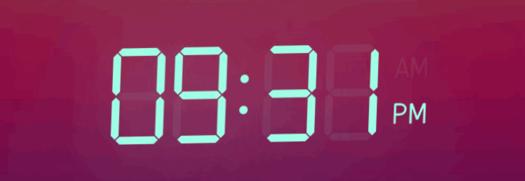

# React Led Digit [](https://www.npmjs.com/package/react-led-digit)

A react component to emulate seven-segment display.  
→ [Codesandbox playground](https://codesandbox.io/p/sandbox/friendly-dewdney-7jvh5w)

Use example:

```tsx
import { Digit, BlinkingDigit } from 'react-led-digit';

<div className="digital-clock">
  <Digit value="0" />
  <Digit value="1" />
  <BlinkingDigit value=":" />
  <Digit value="2" />
  <Digit value="3" />
  <Digit value="am" />
</div>;
```

Styled segments example (see [sandbox](https://codesandbox.io/p/sandbox/react-led-digit-forked-c4f2v3)):

```tsx
import { Digit, BlinkingDigit } from 'react-led-digit';

<>
  <Digit
    value="0"
    segmentStyle={{
      color: 'red',
      colorOff: 'blue',
      length: '1em',
      thickness: '.5em',
      cornerShift: '-.1em',
      spacing: '-.1em',
      shiftAD: '.1em',
      opacityOn: 1,
      opacityOff: 0.25,
      transitionDuration: '.5s',
    }}
  />
  <Digit value="1" shape="rect" />
  <Digit value="2" shape="pill" />
  <Digit value="3" shape="round" />
</>;
```
